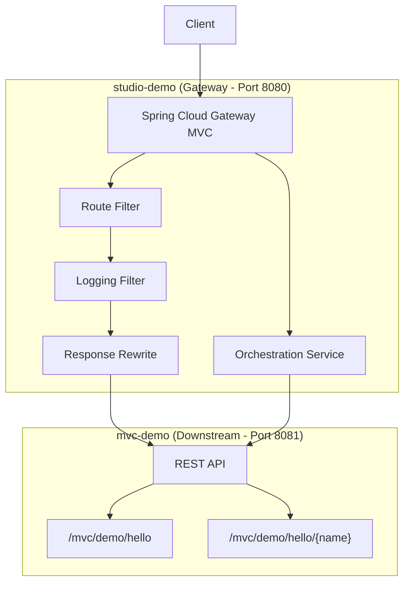

# 实施计划：可代理及可编排的Java Gateway服务

## 项目概述
基于 Spring Cloud Gateway Server MVC 实现一个支持动态路由和服务编排的网关系统，采用 Java 17 + Spring Boot 3.x。

---

## 项目结构

```
agent-studio-demo/
├── pom.xml                    # 父 POM (聚合模块)
├── studio-demo/               # 网关服务
│   ├── pom.xml
│   └── src/main/java/...
└── mvc-demo/                  # 下游服务
    ├── pom.xml
    └── src/main/java/...
```

---

## 技术架构



---

## 模块详细设计

### mvc-demo (下游服务)

#### [NEW] [pom.xml](mvc-demo/pom.xml)
- Spring Boot 3.4.x 依赖
- spring-boot-starter-web
- spring-boot-starter-test

#### [NEW] [MvcDemoApplication.java](mvc-demo/src/main/java/com/example/mvcdemo/MvcDemoApplication.java)
- Spring Boot 启动类

#### [NEW] [ApiResponse.java](mvc-demo/src/main/java/com/example/mvcdemo/model/ApiResponse.java)
- 统一返回结构：`{code, msg, data}`

#### [NEW] [DemoController.java](mvc-demo/src/main/java/com/example/mvcdemo/controller/DemoController.java)
- `GET /mvc/demo/hello` → 返回 "yy"
- `GET /mvc/demo/hello/{name}` → 返回 name

#### [NEW] [application.yml](mvc-demo/src/main/resources/application.yml)
- 端口：8081

---

### studio-demo (网关服务)

#### [NEW] [pom.xml](studio-demo/pom.xml)
- Spring Boot 3.4.x
- spring-cloud-starter-gateway-mvc
- spring-boot-starter-webflux (WebClient for orchestration)
- spring-boot-starter-test

#### [NEW] [StudioDemoApplication.java](studio-demo/src/main/java/com/example/studiodemo/StudioDemoApplication.java)
- Spring Boot 启动类

#### [NEW] [RouteConfig.java](studio-demo/src/main/java/com/example/studiodemo/config/RouteConfig.java)
- 动态路由配置
- 按路径匹配路由规则
- 集成 Logging 和 Response Rewrite 过滤器

#### [NEW] [LoggingFilter.java](studio-demo/src/main/java/com/example/studiodemo/filter/LoggingFilter.java)
- 打印请求报文 (method, uri, headers, body)
- 打印返回报文 (status, body)
- 统计耗时时间

#### [NEW] [ResponseRewriteFilter.java](studio-demo/src/main/java/com/example/studiodemo/filter/ResponseRewriteFilter.java)
- 重写返回报文结构为统一格式

#### [NEW] [OrchestrationController.java](studio-demo/src/main/java/com/example/studiodemo/controller/OrchestrationController.java)
- 编码方式调用下游服务示例
- 使用 RestClient/WebClient 调用 mvc-demo 接口

#### [NEW] [application.yml](studio-demo/src/main/resources/application.yml)
- 端口：8080
- 路由配置 (YAML 方式)
- 下游服务地址配置

---

## 验证计划

### 自动化测试

1. **mvc-demo 单元测试**
   ```bash
   cd mvc-demo && mvn test
   ```
   - DemoControllerTest: 测试两个接口返回正确响应

2. **studio-demo 单元测试**
   ```bash
   cd studio-demo && mvn test
   ```
   - 路由转发测试
   - 编排功能测试

3. **集成测试**
   - 启动 mvc-demo (8081)
   - 启动 studio-demo (8080)
   - 验证网关转发功能

### 性能测试

```bash
# 启动两个服务后执行
ab -t 600 -c 10 http://localhost:8080/mvc/demo/hello
```

验收标准：
- p99 响应时间 < 20ms
- 错误率 = 0%

---

## 开发顺序

1. ✅ 创建父 POM (聚合模块)
2. 📋 开发 mvc-demo (下游服务优先，便于测试网关)
3. 📋 开发 studio-demo (网关服务)
4. 📋 集成测试
5. 📋 性能测试验收
